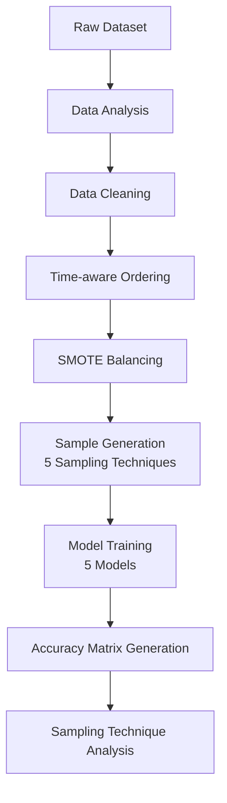
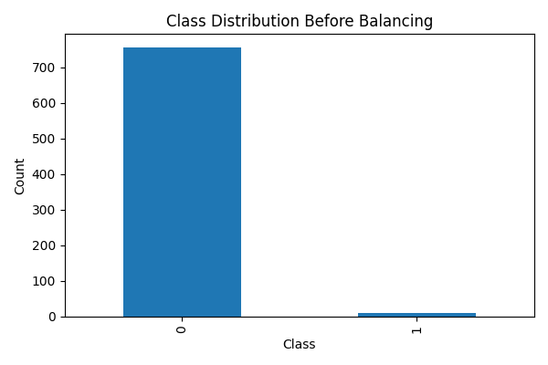
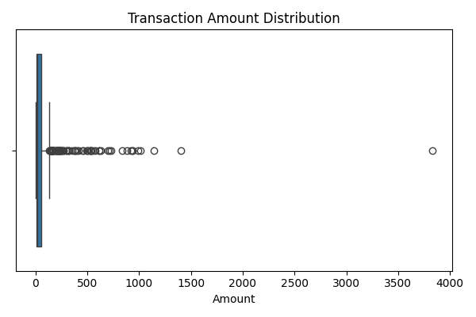
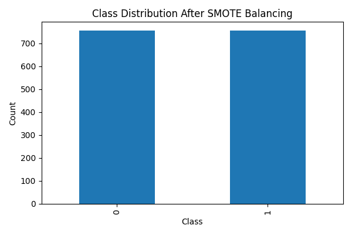
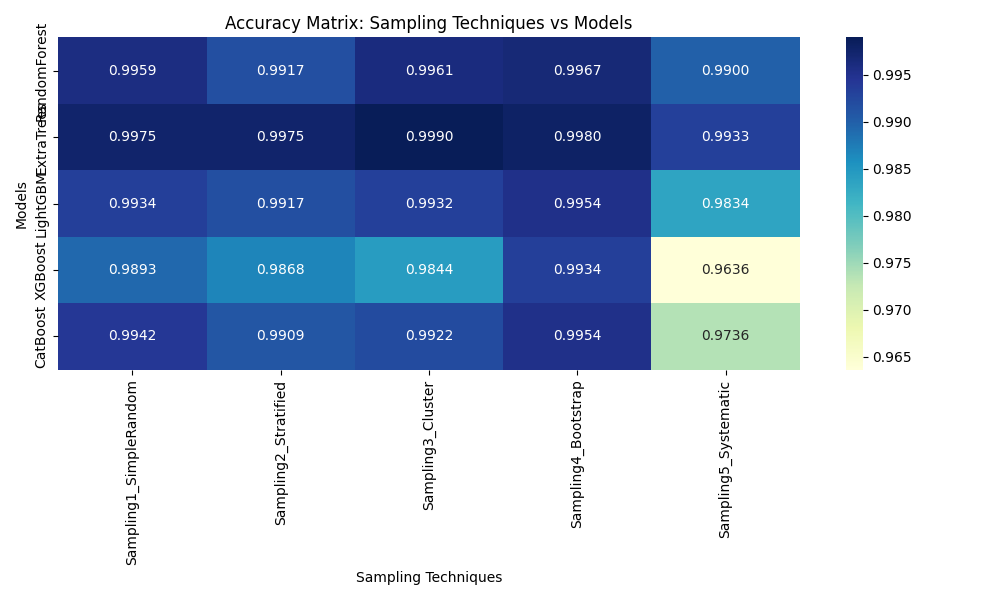
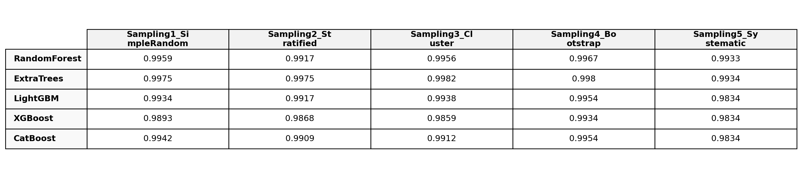
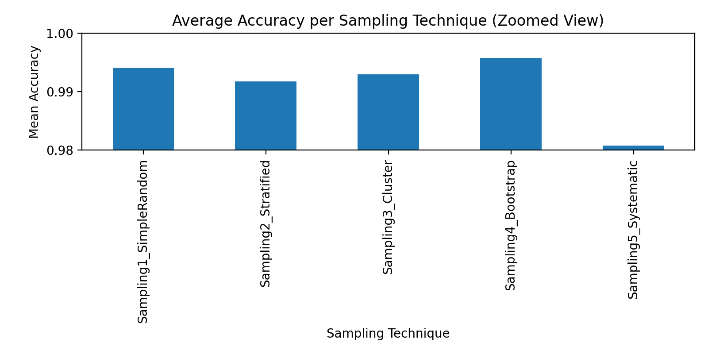

# Sampling Techniques for Imbalanced Credit Card Fraud Detection

---

## Objective

The objective of this assignment is to study the impact of **different sampling techniques** on machine learning model performance when dealing with a **highly imbalanced dataset**.  
The focus of the work is on **sampling strategies**, not on comparing machine learning models.

---

## Workflow Overview



---

## Dataset Description

- **Dataset:** Credit Card Fraud Detection
- **Records:** 772
- **Features:**
  - `Time`: Time elapsed between transactions
  - `V1–V28`: Anonymized PCA-transformed features
  - `Amount`: Transaction amount
  - `Class`: Target variable  
    - `0` → Normal transaction  
    - `1` → Fraudulent transaction  

This dataset represents **time-ordered transactional data**, not classical time-series forecasting data.

---

## Data Analysis

### Class Distribution (Before Balancing)

The dataset is **severely imbalanced**, with fraudulent transactions forming a very small minority.



### Transaction Amount Distribution

Outliers are expected and meaningful in fraud detection problems; therefore, no outlier removal was performed.



---

## Data Cleaning

The following data-cleaning steps were applied:

- Verified absence of missing values
- Removed duplicate rows (if present)
- Ensured all features are numeric
- Sorted dataset by `Time` to preserve temporal order

---

## Data Balancing using SMOTE

### What is SMOTE?

**SMOTE (Synthetic Minority Over-sampling Technique)** creates synthetic samples of the minority class instead of duplicating existing data points.

### Why SMOTE?

- Prevents loss of majority class information
- Avoids overfitting caused by naive oversampling
- Widely used for fraud detection and imbalanced classification tasks

### Class Distribution After SMOTE



---

## Sampling Techniques Applied

After balancing, five different sampling techniques were applied:

1. **Simple Random Sampling**
2. **Stratified Sampling**
3. **Cluster Sampling**
4. **Bootstrapping (Sampling with Replacement)**
5. **Systematic Sampling**

Each technique generates a distinct dataset from the balanced data.

---

## Machine Learning Models Used

The following five models were trained on each sampled dataset:

- Random Forest  
- Extra Trees  
- LightGBM  
- XGBoost  
- CatBoost  

*(Model selection rationale is intentionally omitted to maintain focus on sampling techniques.)*

---

## Model Training and Evaluation

- **Evaluation Metric:** Accuracy  
- **Validation Strategy:** 5-Fold Stratified Cross-Validation  
- **Total Experiments:**  
  5 Sampling Techniques × 5 Models = **25 Experiments**

---

## Accuracy Matrix

The complete accuracy matrix obtained from the experiments is shown below.



### Accuracy Matrix (Tabular View)

The full accuracy matrix is displayed below for clarity and reproducibility.



For transparency and reuse, the raw values are also preserved in CSV format:  
[Sampling × Model Accuracy Matrix (CSV)](embeddings/sampling_model_accuracy_matrix.csv)

---

## Sampling Technique Performance Analysis

To evaluate sampling effectiveness independent of model choice, the **mean accuracy across all models** was computed for each sampling technique.



### Observations

- **Bootstrapping** achieved the highest average accuracy across models
- **Simple Random Sampling** consistently performed well
- **Systematic Sampling** showed the weakest performance
- Sampling strategy significantly impacts performance even after balancing

### Overall Ranking of Sampling Techniques

1. **Bootstrapping**
2. **Simple Random Sampling**
3. Cluster Sampling
4. Stratified Sampling
5. Systematic Sampling

---

## Conclusion

This study demonstrates that **sampling strategy selection plays a critical role** in improving model performance on imbalanced datasets.  
Among all techniques evaluated, **Bootstrapping emerged as the most effective and consistent sampling method** across multiple machine learning models.

---

## Repository Structure

```
.
├── embeddings/
│   ├── class_distribution_before_smote.png
│   ├── class_distribution_after_smote.png
│   ├── amount_distribution.png
│   ├── accuracy_matrix_table.png
|   ├── accuracy_heatmap.png
│   ├── sampling_mean_accuracy.png
│   ├── sampling_model_accuracy_matrix.csv
│   └── sampling_mean_accuracy.csv
│
├── main.ipynb
├── Creditcard_data.csv
└── README.md
```

---
